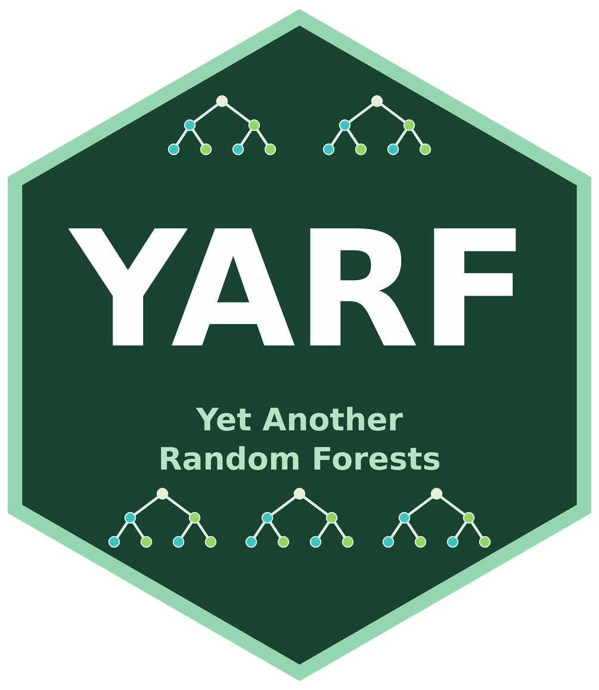

# YARF: Yet Another Random Forests Package 

[](https://github.com/kapelner/YARF/actions/workflows/R-CMD-check.yaml)
[](https://github.com/kapelner/YARF/actions/workflows/pkgdown.yaml)
[](https://kapelner.r-universe.dev/YARF)
[](../LICENSE)

YARF—Yet Another Random Forests package—is a customizable, asynchronous, and
parallelized random-forest implementation for R. It supports custom JavaScript
splitting and aggregation behavior, missingness incorporated in attributes,
and random-forest-based imputation.

## Highlights

- Classification and regression forests with out-of-bag diagnostics
- Custom JavaScript split rules and aggregation functions
- Missingness incorporated in attributes (MIA)
- Random-forest-based missing-value imputation
- Asynchronous and parallel tree construction
- Variable-importance, interaction, proximity, and tree-inspection tools

## Installation

YARF is distributed through the kapelner R-universe, not CRAN:

```r
install.packages(
  "YARF",
  repos = c(
    kapelner = "https://kapelner.r-universe.dev",
    CRAN = "https://cloud.r-project.org"
  )
)
```

Java 8 or newer is required.

## Quick start

```r
library(YARF)

fit <- YARF(
  X = iris[, 1:4],
  y = iris$Species,
  num_trees = 100
)

predict(fit, iris[, 1:4])
```

See the [package website](https://kapelner.github.io/YARF/) for the getting-started
guide and reference, and the
[R-universe package page](https://kapelner.r-universe.dev/YARF) for builds and
binaries.

## Citation and license

Run `citation("YARF")` for citation details. YARF is maintained by Adam Kapelner
with contributions from Matt Olson and Abhinav Patil and is released under
GPL-3.
